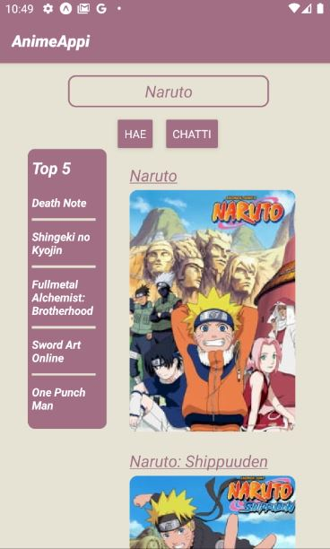
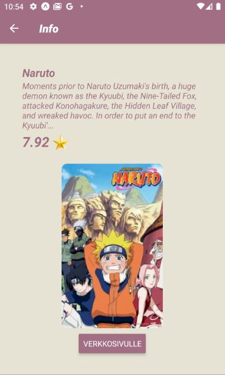
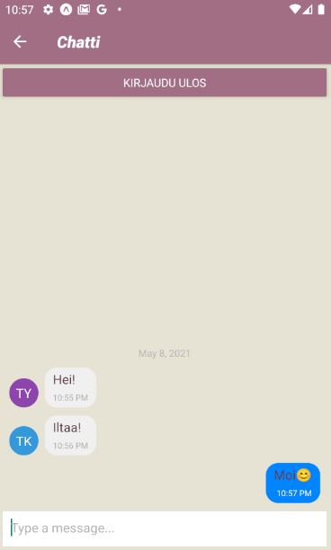

# Mobileprogramming-AnimeAppi

## Description

Android app to search animes and to chat with other users through chat feature. This was developed as a final project on mobile programming course in [Haaga-Helia University of Applied Sciences](https://www.haaga-helia.fi/en). 


## Built with
* [Expo](https://expo.io/)
* [React Native](https://reactnative.dev/)
* [react-native-gifted-chat](https://github.com/FaridSafi/react-native-gifted-chat)
* [React Navigation](https://reactnavigation.org/docs/getting-started)
* [Firebase Cloud Firestore](https://firebase.google.com/docs/firestore)


# Getting Started

Follow instructions below to get started

## Requirements

Install these to begin
* npm

Instructions: [NPM](https://www.npmjs.com/get-npm)

* Expo CLI
```sh
npm install --global expo-cli
```

## Installation

### Clone the repo
   ```sh
   git clone https://github.com/joonasrom/Mobileprogramming-AnimeAppi.git
   ```
### Install NPM packages
   ```sh
   npm install
   ```
### Start Expo
   ```sh
   expo start
   ```

# Usage

On the main screen, you will see the names of the five most popular animes on the left. On the right you can see the titles and images of the animes, sorted by their names. You can scroll down to see more, but the maximum number of results is 10. There is a search bar at the top. When you press any title or image on the left or right, you will be directed to the information page for that anime.

Pressing the chat button will take you to a login page where you can choose your own name. Chat also has a logout button.


  &nbsp;&nbsp;&nbsp;&nbsp;&nbsp;&nbsp;&nbsp;&nbsp;  &nbsp;&nbsp;&nbsp;&nbsp;&nbsp;&nbsp;&nbsp;&nbsp; 
